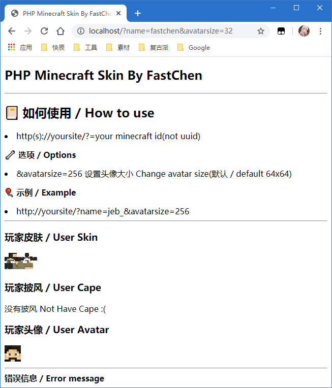

# \[开源] PHP Minecraft Skin 🎉


代码已托管至[Github](https://github.com/FastChen/PHP-Minecraft-Skin)，欢迎提交issues


## **PHP-Minecraft-Skin**

一个简单使用Mojang API 获取玩家皮肤与披风并且通过皮肤生成头像的例子

### 📔 如**何使**用 / How to use

* http(s)://yoursite/?=your minecraft id(not uuid)

### **🔧 选项 / Options**

* \&avatarsize=256 设置头像大小 Change avatar size(默认 / default 64x64)

### **🎈 示例 / Example**

* [http://yoursite/?name=jeb\_\&avatarsize=256](http://yoursite/?name=jeb\_\&avatarsize=256)

## **其他信息 / Other info**

### **💻 其他语言 / Other Programming language**

* [C#-NullCraft-Minecraft-Skin](https://github.com/FastChen/NullCraft-Minecraft-Skin)

### **🧾 API使用说明 / API Use**

* [写了个PHP版Minecraft皮肤获取与生成头像并开源](https://fastchen.com/skill/phpminecraftskin.html)
* [无聊写了个Minecraft皮肤获取，分享一些API](https://fastchen.com/works/minecraftskin.html)

### **🖼 图片 / image**

